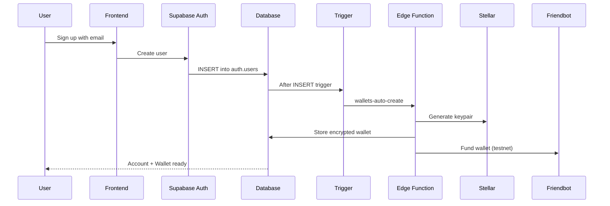
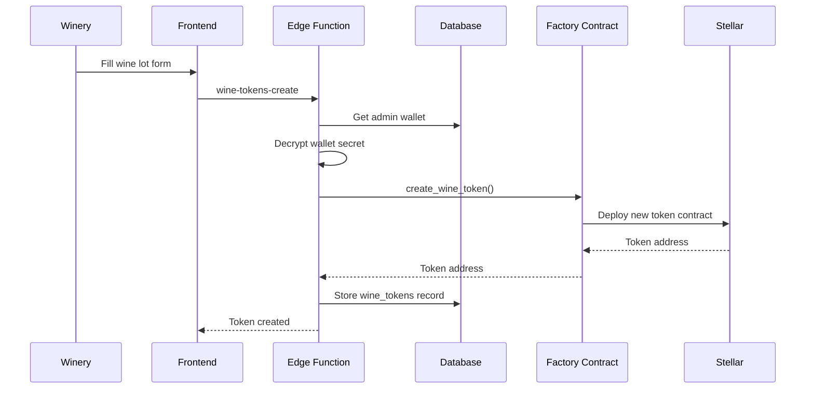
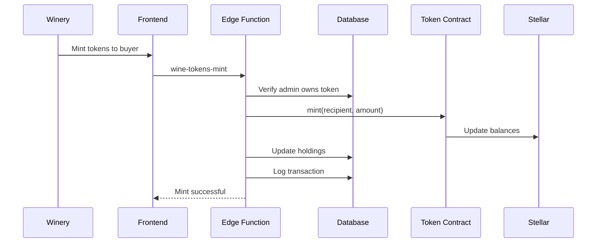
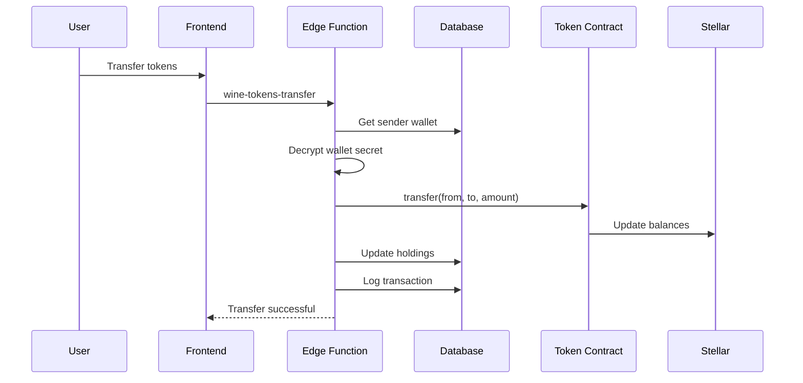

# Wine Token Integration Guide

This document explains how the wine token system integrates with the custodial wallet infrastructure.

## 🎯 Overview

The WineFi platform now features a complete wine tokenization system that allows:
- **Wineries/Admins**: Create tokenized wine lots with metadata
- **Users**: Receive, hold, and transfer wine tokens using invisible custodial wallets
- **Automatic Wallet Creation**: New users get Stellar wallets automatically on signup
- **Blockchain Integration**: All operations are recorded on Stellar's Soroban

## 🏗️ Architecture

```
┌─────────────────────────────────────────────────────────────────┐
│                         Frontend (Next.js)                       │
│  - Create Wine Lot UI (nuevo-lote)                              │
│  - View Holdings (portafolio)                                   │
│  - Browse Tokens (lotes)                                        │
│  - Transfer Tokens                                              │
└────────────────────┬────────────────────────────────────────────┘
                     │
                     │ lib/wine-tokens.ts (Client SDK)
                     │
┌────────────────────┼────────────────────────────────────────────┐
│                    │    Supabase Edge Functions                  │
│  ┌─────────────────┼─────────────────────────────────────────┐  │
│  │ wine-tokens-create │ wine-tokens-mint │ wine-tokens-transfer │
│  └─────────────────┬─────────────────────────────────────────┘  │
│                    │                                             │
│  ┌─────────────────┼─────────────────────────────────────────┐  │
│  │         _shared/soroban.ts (Soroban SDK)                  │  │
│  │  - createWineToken() - mintWineTokens()                   │  │
│  │  - transferWineTokens() - getWineTokenMetadata()          │  │
│  └─────────────────┬─────────────────────────────────────────┘  │
│                    │                                             │
│  ┌─────────────────┼─────────────────────────────────────────┐  │
│  │         _shared/custodial.ts (Wallet Management)          │  │
│  │  - getOrCreateWallet() - decryptSecret()                  │  │
│  │  - logWalletActivity()                                    │  │
│  └─────────────────┬─────────────────────────────────────────┘  │
└────────────────────┼─────────────────────────────────────────────┘
                     │
┌────────────────────┼─────────────────────────────────────────────┐
│              PostgreSQL Database (Supabase)                      │
│  ┌───────────────────────────────────────────────────────────┐  │
│  │ user_wallets │ wine_tokens │ wine_token_holdings │         │  │
│  │ wine_token_transactions │ wallet_activity_logs            │  │
│  └───────────────────────────────────────────────────────────┘  │
└────────────────────┬─────────────────────────────────────────────┘
                     │
┌────────────────────┼─────────────────────────────────────────────┐
│              Stellar Blockchain (Soroban)                        │
│  ┌───────────────────────────────────────────────────────────┐  │
│  │ Wine Factory Contract │ Wine Token Contracts               │  │
│  │ (CAJS6NHHCY3...)      │ (One per wine lot)                │  │
│  └───────────────────────────────────────────────────────────┘  │
└──────────────────────────────────────────────────────────────────┘
```

## 🔄 User Flow

### 1. User Signup (Automatic Wallet Creation)



**Key Points:**
- Wallet creation is **invisible** to the user
- Private keys are **encrypted** using AES-256-GCM
- Wallet is **automatically funded** on testnet
- Process is **non-blocking** (user signup succeeds even if wallet creation fails)

### 2. Create Wine Token (Winery/Admin)



**Request:**
```json
{
  "name": "Malbec Reserve 2024",
  "symbol": "MAL24",
  "decimal": 0,
  "wine_metadata": {
    "lot_id": "MAL-2024-001",
    "winery_name": "Bodega Catena",
    "region": "Mendoza",
    "country": "Argentina",
    "vintage": 2024,
    "varietal": "Malbec",
    "bottle_count": 1000,
    "description": "Premium Reserve",
    "token_code": "MAL24"
  }
}
```

### 3. Mint Tokens (Winery/Admin)



**Request:**
```json
{
  "token_address": "CDY4ZOUZD657RTB7WXALMDXGBRGIKNOVBMHY5THLNLXZVYEW63GHGZU2",
  "recipient_address": "GABC...XYZ",
  "amount": 100
}
```

### 4. Transfer Tokens (Any User)



**Request:**
```json
{
  "token_address": "CDY4ZOUZD657RTB7WXALMDXGBRGIKNOVBMHY5THLNLXZVYEW63GHGZU2",
  "to_address": "GDEF...ABC",
  "amount": 10
}
```

## 📊 Database Schema

### `user_wallets`
Stores custodial wallet information for each user.

```sql
CREATE TABLE user_wallets (
    id UUID PRIMARY KEY,
    user_id UUID REFERENCES auth.users(id),
    public_key TEXT NOT NULL UNIQUE,
    secret_encrypted TEXT,  -- AES-256-GCM encrypted
    wallet_provider TEXT DEFAULT 'vinefi_custodial',
    network TEXT DEFAULT 'stellar',
    created_at TIMESTAMPTZ,
    last_used_at TIMESTAMPTZ
);
```

### `wine_tokens`
Tracks all deployed wine token contracts.

```sql
CREATE TABLE wine_tokens (
    id UUID PRIMARY KEY,
    factory_id TEXT NOT NULL,
    token_address TEXT NOT NULL UNIQUE,
    name TEXT NOT NULL,
    symbol TEXT NOT NULL,
    decimal INTEGER DEFAULT 0,
    wine_metadata JSONB NOT NULL,  -- Wine lot information
    created_by UUID REFERENCES auth.users(id),
    admin_wallet_id UUID REFERENCES user_wallets(id),
    created_at TIMESTAMPTZ,
    updated_at TIMESTAMPTZ
);
```

### `wine_token_holdings`
Caches user token balances (synced from blockchain).

```sql
CREATE TABLE wine_token_holdings (
    id UUID PRIMARY KEY,
    user_id UUID REFERENCES auth.users(id),
    wallet_id UUID REFERENCES user_wallets(id),
    token_id UUID REFERENCES wine_tokens(id),
    balance BIGINT DEFAULT 0,
    last_updated TIMESTAMPTZ,
    UNIQUE(user_id, token_id)
);
```

### `wine_token_transactions`
Complete transaction history.

```sql
CREATE TABLE wine_token_transactions (
    id UUID PRIMARY KEY,
    token_id UUID REFERENCES wine_tokens(id),
    from_wallet UUID REFERENCES user_wallets(id),
    from_address TEXT,
    to_wallet UUID REFERENCES user_wallets(id),
    to_address TEXT NOT NULL,
    amount BIGINT NOT NULL,
    transaction_hash TEXT NOT NULL,
    transaction_type TEXT NOT NULL,  -- 'mint', 'transfer', 'burn'
    metadata JSONB,
    created_at TIMESTAMPTZ
);
```

## 🔐 Security

### Wallet Security
- **Private keys** are encrypted using AES-256-GCM before storage
- **Encryption key** is stored securely in Supabase secrets
- Keys are **decrypted only** in secure edge functions (never on client)
- Each transaction is **signed server-side** using the user's custodial wallet

### Row Level Security (RLS)
All tables have RLS policies:
- Users can **only view their own** wallets and holdings
- Users can **only transfer their own** tokens
- Service role (edge functions) has **full access** for automation
- Wine tokens are **publicly viewable** (transparency)

### Permission Model
```typescript
// Example RLS Policy
CREATE POLICY "Users can view their own wallets"
    ON user_wallets
    FOR SELECT
    USING (auth.uid() = user_id);
```

## 🎨 Frontend Integration

### Client SDK Usage

```typescript
import {
  createWineToken,
  mintWineTokens,
  transferWineTokens,
  getUserHoldings,
  getUserTransactions,
} from '@/lib/wine-tokens';

// Create a wine token (admin only)
const result = await createWineToken(
  "Malbec Reserve 2024",
  "MAL24",
  {
    lot_id: "MAL-2024-001",
    winery_name: "Bodega Catena",
    region: "Mendoza",
    country: "Argentina",
    vintage: 2024,
    varietal: "Malbec",
    bottle_count: 1000,
    token_code: "MAL24"
  }
);

// Mint tokens to a user
await mintWineTokens(
  tokenAddress,
  recipientAddress,
  100
);

// Transfer tokens
await transferWineTokens(
  tokenAddress,
  recipientAddress,
  10
);

// Get user's holdings
const holdings = await getUserHoldings();

// Get user's transaction history
const transactions = await getUserTransactions();
```

### Real-time Updates

```typescript
import { subscribeToHoldings } from '@/lib/wine-tokens';

// Subscribe to balance updates
const subscription = subscribeToHoldings((payload) => {
  console.log('Balance updated:', payload);
  // Refresh UI
});

// Cleanup
subscription.unsubscribe();
```

## 🚀 Deployment

### 1. Deploy Contracts

```bash
cd contracts
./deploy_wine_token.sh testnet winefi-admin
source .deployed_wine_token_testnet.env
```

### 2. Configure Environment

```bash
# Set frontend env
echo "NEXT_PUBLIC_WINE_FACTORY_ID=$WINE_FACTORY_ID" >> .env.local

# Set Supabase secrets
supabase secrets set WINE_FACTORY_ID=$WINE_FACTORY_ID
supabase secrets set TOKEN_WASM_HASH=$TOKEN_WASM_HASH
```

### 3. Apply Migrations

```bash
cd supabase
supabase db push
```

### 4. Deploy Edge Functions

```bash
supabase functions deploy wine-tokens-create
supabase functions deploy wine-tokens-mint
supabase functions deploy wine-tokens-transfer
```

## 🧪 Testing

### Test Wallet Creation

```bash
# Signup a new user - wallet created automatically
curl -X POST "https://your-project.supabase.co/auth/v1/signup" \
  -H "Content-Type: application/json" \
  -d '{"email": "test@example.com", "password": "password123"}'

# Verify wallet exists
# Login and check user_wallets table
```

### Test Token Creation

```bash
curl -X POST "https://your-project.supabase.co/functions/v1/wine-tokens-create" \
  -H "Authorization: Bearer YOUR_TOKEN" \
  -H "Content-Type: application/json" \
  -d '{
    "name": "Test Malbec",
    "symbol": "TST24",
    "wine_metadata": {
      "lot_id": "TST-2024-001",
      "winery_name": "Test Winery",
      "region": "Mendoza",
      "country": "Argentina",
      "vintage": 2024,
      "varietal": "Malbec",
      "bottle_count": 100,
      "token_code": "TST24"
    }
  }'
```

## 📝 Common Operations

### Get User's Wallet Address

```typescript
const walletAddress = await getUserWalletAddress();
console.log('My wallet:', walletAddress);
```

### List All Wine Tokens

```typescript
const allTokens = await getAllWineTokens();
console.log('Available tokens:', allTokens);
```

### Get Token Details

```typescript
const token = await getWineToken(tokenAddress);
console.log('Token metadata:', token.wine_metadata);
```

## 🐛 Troubleshooting

### Wallet not created
- Check `wallets-auto-create` function logs
- Verify `pg_net` extension is enabled
- Check trigger is active: `SELECT * FROM pg_trigger WHERE tgname = 'trigger_create_wallet_on_signup';`

### Token creation fails
- Verify `WINE_FACTORY_ID` is set in Supabase secrets
- Check admin wallet has XLM for fees
- Verify factory contract is deployed and initialized

### Transfer fails
- Check sender has sufficient balance
- Verify wallet secret decryption works
- Check Stellar network status

## 📚 Resources

- [Stellar Documentation](https://developers.stellar.org/)
- [Soroban Smart Contracts](https://soroban.stellar.org/)
- [Supabase Edge Functions](https://supabase.com/docs/guides/functions)
- [Contract Source Code](./contracts/)
- [Environment Setup](./ENVIRONMENT_SETUP.md)

## 🆘 Support

For issues or questions:
1. Check edge function logs in Supabase dashboard
2. Verify environment variables are set correctly
3. Test contract invocations directly with Stellar CLI
4. Review transaction on Stellar Explorer
